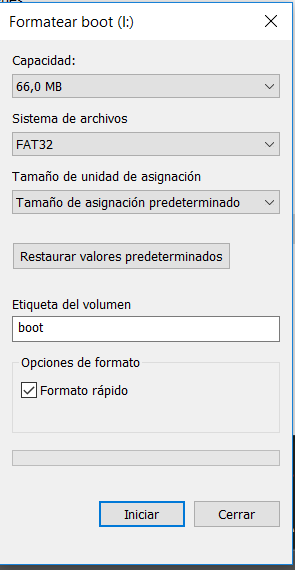
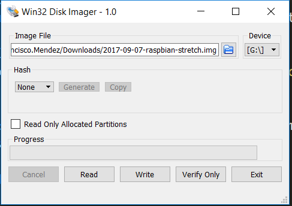
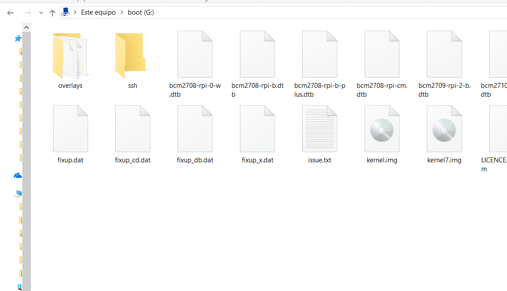
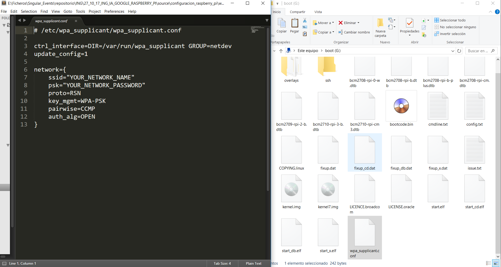

# {ing}tech_it : Configuración Raspberry Pi

Configuración Raspberry Pi

Para la configuración de la Raspberry Pi hemos utilizado un equipo Windows y el programa Win32 Disk Imagen para grabar la imagen rasbian en la SD.

Los pasos seguidos son:
## Instalar Sistema Operativo Rasbian en nuestra SD (Minimo 8Gb)

En primer lugar descargamos la imagen rasbian desde la página oficial de raspberry pi y la guardamos en nuestro ordenador [enlace descarga](https://www.raspberrypi.org/downloads/raspbian/).

Una vez descargado la imagen introducimos la micro-sd en nuestro PC y la formateamos en FAT32 pulsando el botón derecho sobre la SD y dandole a formatear SD.

Ahora abrimos el programa Win32 Disk Imager [enlace descarga](https://sourceforge.net/projects/win32diskimager/) y seleccionamos la SD (Ojo!! Elegir la SD para no borrar otra tarjeta distinta) y le damos al botón "Write" para que nos grabe la imagen que hemos descargado en la SD.

## Configurar ssh y acceso a internet en la sd

Ahora sin sacar la SD del ordenador accedemos a su contenido y seguimos estos dos pasos:
1. Crear un directorio vacio con el nombre ssh en la raíz de la sd.

2. Crear un fichero llamado wpa_supplicant.conf con las credenciales de todos los datos de nuestra conexión WiFi para que al encenderla se conecte sola a la WiFi.

## Arrancar la Raspberry Pi y acceder a ella por ssh

Una vez hemos realizado todos los pasos anteriores nos disponemos a encender la Raspberry Pi y acceder a ella por ssh si estamos conectado a la misma red WiFi que la Raspberry Pi.

Para realizar el acceso por ssh podemos usar putty (En Windows) o terminal (En Mac o Linux). Para este acceso necesitamos saber la IP que nuestra red WiFi le ha asignado a nuestra Raspberry Pi, para ello podemos usar un analizador de red como puede ser Advanced IP Scanner (En Windows) o IP Scanner (En Mac), en este programa nos mostrará todos los dispositivos que estan conectados a la red, y en uno de ellos nos aparecera la Raspberry Pi marcada con el nombre (En Windows) o el icono de la Raspberry Pi (En Mac).

Una vez tenemos la IP procedemos acceder a ella através de ssh y el usuario por defecto es "pi" y la password "raspberry".

## Configurar Microfono USB en la Raspberry Pi

Para finalizar este paso vamos a configurar el microfono usb en nuestra Raspberry Pi para ello vamos a conectar el microfono a uno de las USB de la Raspberry Pi y vamos a probar que emite sonido y que graba sonido, podemos utilizar para escuchar el sonido unos auriculares conectados al mini jack 3.5 que trae la Raspberry Pi.

1. Emite sonido

Para probar que emite sonido lanzamos el siguiente comando en la consola (accediendo por ssh a la Raspberry Pi como en el paso anterior)

~~~
speaker-test -t wav  
~~~

2. Graba sonido

Lanzamos el siguiente comando que graba 5 segundos

~~~
arecord --format=S16_LE --duration=5 --file-type=raw out.raw 
~~~

Escuchamos si ha grabado correctamente

~~~
aplay --format=S16_LE out.raw  
~~~

[+Ayuda](https://developers.google.com/assistant/sdk/develop/python/hardware/audio)

--------
Continuar al  [Paso 4](./instalacion_sdk_google_assistant.md) o ir al [Indice](./index.md)